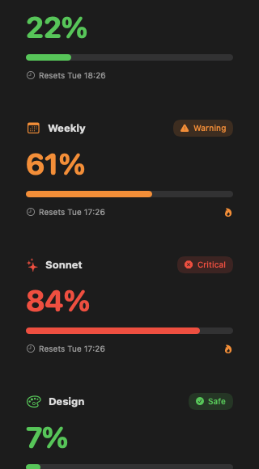
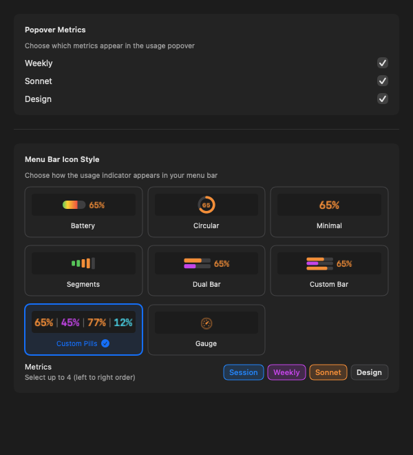

<h1 align="center">
  <br>
  🤖 ClaudeMeter
  <br>
</h1>

<p align="center">
  <strong>Real-time Claude.ai usage monitoring in your macOS menu bar.</strong><br>
  Automatic metric discovery — new limits appear the moment Anthropic adds them.
</p>

<p align="center">
  
  
  
  <a href="https://ko-fi.com/lucidfabrics">
    
  </a>
  <a href="https://buymeacoffee.com/lucidfabrics">
    
  </a>
  <a href="https://github.com/sponsors/wmehanna">
    
  </a>
</p>

---

## 🧰 What It Does

ClaudeMeter sits in your macOS menu bar and tracks every usage limit Claude.ai reports — 5-hour session, 7-day weekly, Sonnet, Design, and any new limits Anthropic adds in the future. No app update required.

**You get:**
- A colour-coded menu bar icon that changes with your usage level
- A click-to-expand popover with per-metric progress bars and reset countdowns
- 8 icon styles to match your workflow and density preferences
- Smart notifications at configurable warning and critical thresholds
- A local JSON export at `~/.claudemeter/usage.json` for shell prompts, Claude Code statusline, and custom dashboards

### How It Compares to the Original

| | [eddmann/ClaudeMeter](https://github.com/eddmann/ClaudeMeter) | This fork |
|---|---|---|
| New API metrics | Requires app update | Auto-discovered at runtime |
| Icon styles | 6 | 8 (+ Custom Pills, Custom Bar) |
| Multi-metric icon | Fixed 3-metric triple pills | Up to 4 metrics, reorderable |
| Popover visibility | Sonnet toggle only | Per-metric toggle for every discovered limit |
| Metric colours | Hard-coded | Hash-stable palette for unknown future metrics |
| Settings migration | — | Non-crashing migration from all prior formats |

---

## 📸 Screenshots

### Usage Popover

Click the menu bar icon to see live usage for every discovered metric:

<p align="center">
  
</p>

Each card shows the current percentage, a colour-coded progress bar, the reset time, and a pacing flame when you are consuming your quota faster than it replenishes.

### Menu Bar Icon Styles

<p align="center">
  
  &nbsp;&nbsp;&nbsp;
  
  &nbsp;&nbsp;&nbsp;
  
</p>

*Left to right: Custom Pills (3 metrics, colour-coded per limit), Dual Bar (session + weekly), Battery (single metric)*

### Settings

Configure icon style, choose which metrics appear in each view, and toggle popover visibility per metric:

<p align="center">
  
</p>

The **Popover Metrics** section lists every metric the API currently returns. The **Metrics** chip row lets you reorder and limit which metrics appear in multi-metric icon styles.

---

## ✨ New Features in This Fork

### Dynamic Metric Discovery

The original app had metrics hard-coded as a Swift enum. This fork replaces that with a runtime `DiscoveredMetric` struct and a dynamic JSON decoder (`AnyCodingKey`) that reads any field the API returns. When Anthropic adds `seven_day_opus` or a new window type, it shows up automatically.

### Custom Pills Icon Style

Display up to 4 live percentages side-by-side in your menu bar, each in a distinct colour:

| Metric key | Colour |
|---|---|
| `five_hour` (session) | Follows usage status (green / orange / red) |
| `seven_day` (weekly) | Purple |
| `seven_day_sonnet` | Orange |
| `seven_day_omelette` (Design) | Teal |
| Any future metric | Hash-stable colour from a fixed palette |

### Custom Bar and Dual Bar

Both styles now support any metric — not just session. Pick any two discovered metrics for Dual Bar, or configure Custom Bar to track the limit you care about most.

### Per-Metric Popover Visibility

Each discovered limit gets its own toggle in Settings. Previously only Sonnet had a show/hide switch. Now every metric the API returns is individually controllable.

### Metric Chip Picker

A reorderable chip row lets you drag metrics into the order you want them displayed in multi-metric icon styles. Tap a chip to add or remove it, up to a 4-metric maximum.

---

## 🚀 Installation

### Build from Source (Recommended)

```bash
git clone https://github.com/wmehanna/ClaudeMeter.git
cd ClaudeMeter
open ClaudeMeter.xcodeproj
# Press ⌘R in Xcode
```

Requires Xcode 16.0+ and macOS 14.0 (Sonoma)+.

### Manual Download

1. Download the latest release from [GitHub Releases](https://github.com/wmehanna/ClaudeMeter/releases)
2. Unzip and move `ClaudeMeter.app` to Applications
3. Right-click → Open on first launch (unsigned in this fork)

---

## 🔑 Finding Your Session Key

Your Claude session key is stored in your browser cookies.

**Chrome / Edge:**
1. Open [claude.ai](https://claude.ai)
2. Press `F12` → Application → Cookies → `https://claude.ai`
3. Copy the `sessionKey` value (starts with `sk-ant-`)

**Safari:**
1. Open [claude.ai](https://claude.ai)
2. Develop → Show Web Inspector → Storage → Cookies → `https://claude.ai`
3. Copy the `sessionKey` value

**Firefox:**
1. Open [claude.ai](https://claude.ai)
2. Press `F12` → Storage → Cookies → `https://claude.ai`
3. Copy the `sessionKey` value

---

## 🔗 Integration with External Tools

ClaudeMeter exports usage data to `~/.claudemeter/usage.json`:

```json
{
  "last_updated": "2025-12-24T07:30:00Z",
  "session_usage":  { "reset_at": "2025-12-24T12:00:00Z", "utilization": 22 },
  "weekly_usage":   { "reset_at": "2025-12-30T00:00:00Z", "utilization": 61 },
  "metric_values": {
    "five_hour":         { "reset_at": "2025-12-24T12:00:00Z", "utilization": 22 },
    "seven_day":          { "reset_at": "2025-12-30T00:00:00Z", "utilization": 61 },
    "seven_day_sonnet":   { "reset_at": "2025-12-30T00:00:00Z", "utilization": 84 },
    "seven_day_omelette": { "reset_at": "2025-12-24T17:00:00Z", "utilization": 7  }
  }
}
```

**Claude Code statusline** — create `~/.claude/statusline.sh`:

```bash
#!/bin/bash
usage=$(jq -r '.session_usage.utilization' ~/.claudemeter/usage.json 2>/dev/null)
if [ -z "$usage" ] || [ "$usage" = "null" ]; then
  echo "Usage: ~"
elif [ "$usage" -lt 50 ]; then
  echo -e "\033[32mUsage: ${usage}%\033[0m"
elif [ "$usage" -lt 80 ]; then
  echo -e "\033[33mUsage: ${usage}%\033[0m"
else
  echo -e "\033[31mUsage: ${usage}%\033[0m"
fi
```

Then in `~/.claude/settings.json`:

```json
{
  "statusLine": {
    "type": "command",
    "command": "bash ~/.claude/statusline.sh"
  }
}
```

---

## ⚠️ Disclaimer

**This is an unofficial tool** and is not affiliated with, endorsed by, or supported by Anthropic PBC.

This application accesses Claude's web API using browser-based authentication. **This may violate Anthropic's Terms of Service.** By using ClaudeMeter you acknowledge that:

- Anthropic may block, restrict, or terminate access at any time
- Your Claude account could be affected by using unofficial API clients
- **Use at your own risk** — the developer assumes no liability

**Data storage:**
- Session keys are stored securely in macOS Keychain (encrypted, device-local only)
- Usage data is cached locally (unencrypted, contains usage percentages only)
- No data is sent to third-party servers

---

## 🙏 Credits & License

Based on [ClaudeMeter](https://github.com/eddmann/ClaudeMeter) by [Edd Mann](https://github.com/eddmann), MIT License.

Built and maintained in my free time. If it keeps you from burning your Claude quota unexpectedly, [a coffee helps](https://ko-fi.com/lucidfabrics) or [buy me one on BMC](https://buymeacoffee.com/lucidfabrics). ☕

MIT License — see [LICENSE](LICENSE) for details.
